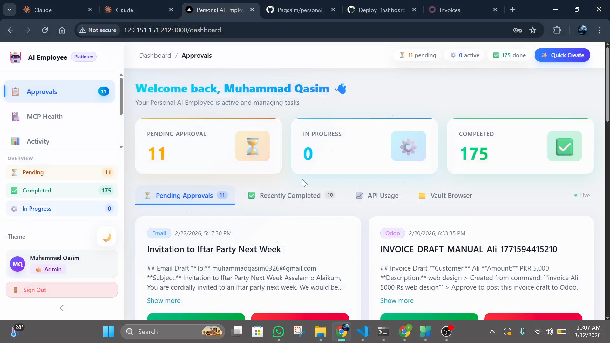
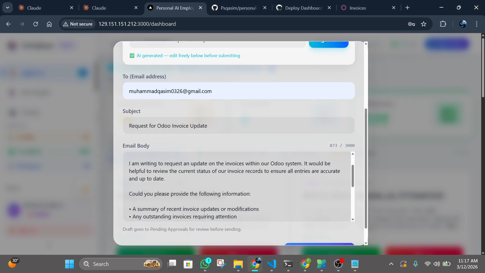
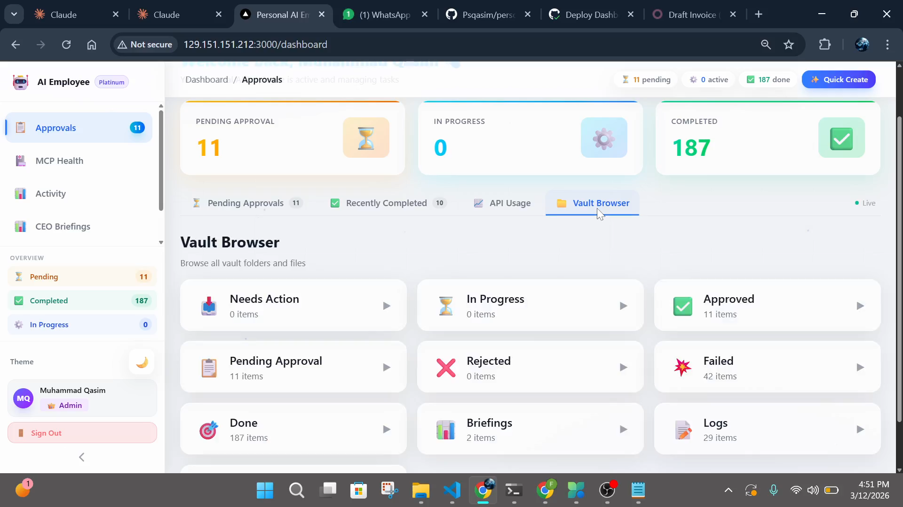
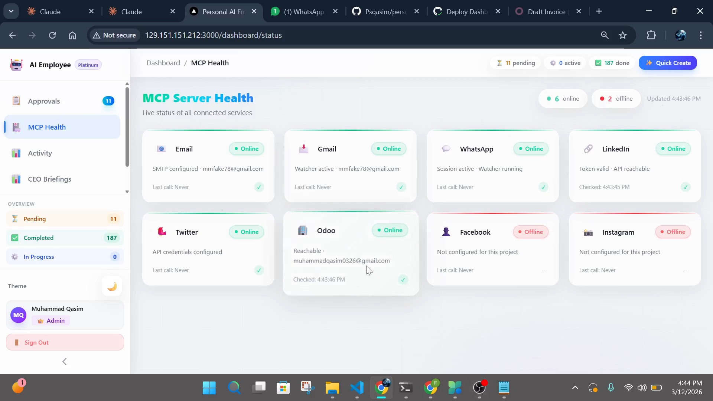
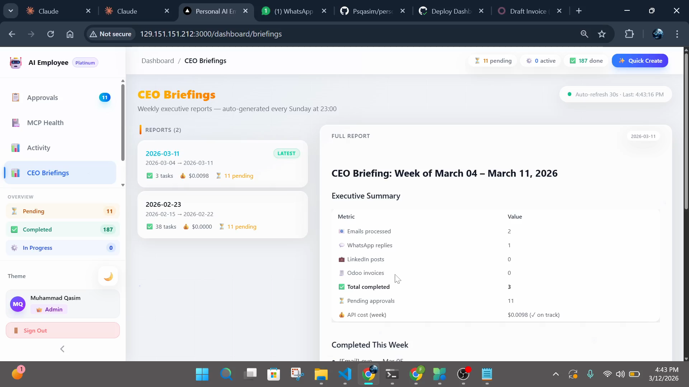
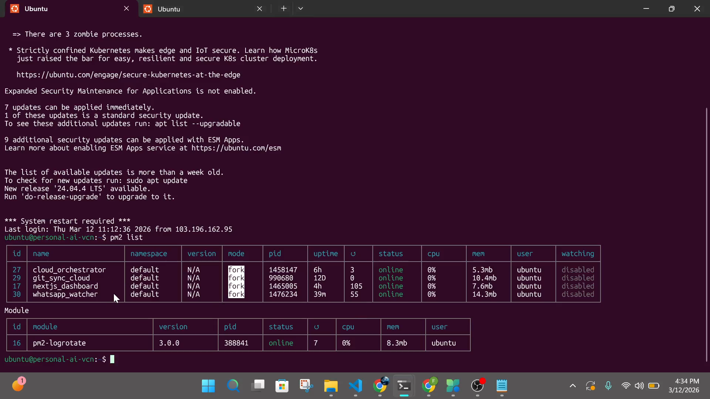
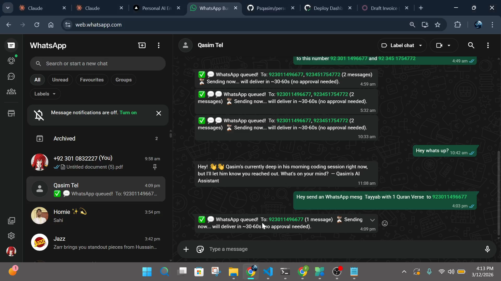
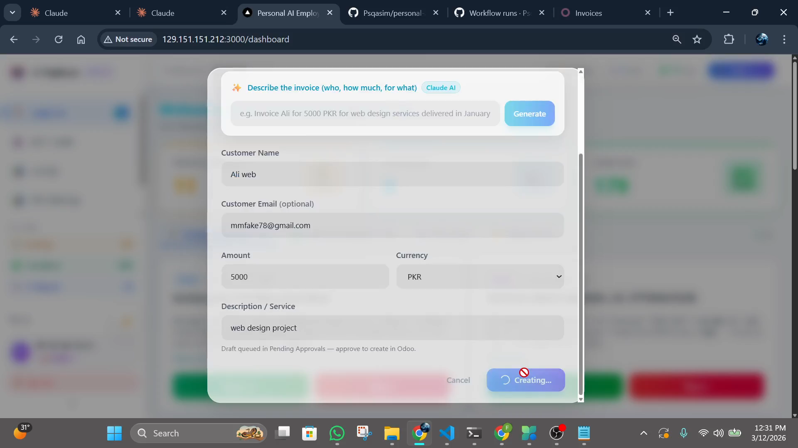
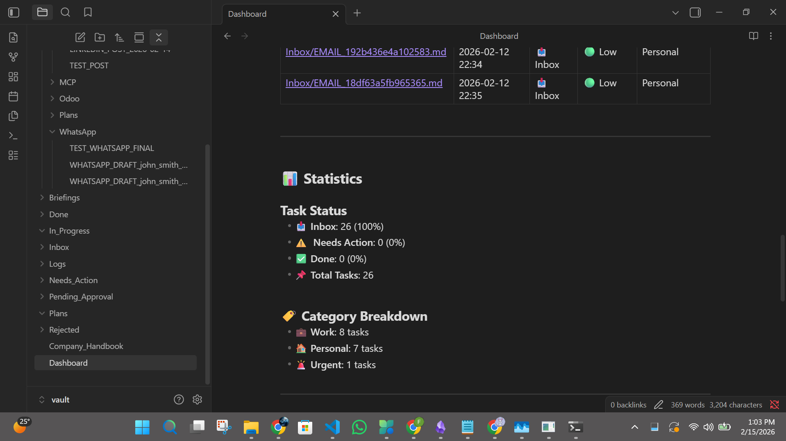

# Personal AI Employee

> **Your autonomous Digital FTE that manages email, WhatsApp, LinkedIn, and Odoo accounting — 24/7 on Oracle Cloud, with human-in-the-loop approval.**

[](https://www.python.org/downloads/)
[](https://nextjs.org/)
[](https://anthropic.com)
[](https://cloud.oracle.com)
[](https://opensource.org/licenses/MIT)

**Built for:** GIAIC Personal AI Employee Hackathon 2026 (Q4)
**Developer:** Muhammad Qasim (Solo + Claude Code)
**Status:** Production Running on Oracle Cloud VM 24/7

---

## Demo Video

> **[Watch the Demo (YouTube)](https://youtu.be/vm0i13t1Z_4?si=QzAl7o0GIe4mWN2b)** — Full walkthrough of all features

---

## What Is This?

A **Digital Full-Time Employee (FTE)** that works 24/7 managing your business operations:

- Watches your **Gmail** for important emails and drafts AI replies
- Monitors **WhatsApp** and auto-replies with context-aware AI responses
- Generates **LinkedIn** posts aligned with your business goals
- Creates **Odoo invoices, contacts, payments, and purchase bills**
- Sends you **WhatsApp notifications** for urgent items
- Generates **weekly CEO Briefings** with AI insights
- Accepts **natural language commands** via CLI or WhatsApp (`"invoice Ali 5000 Rs"`)
- All sensitive actions require **human approval** before execution

**Cost comparison:** A human employee works ~2,000 hrs/year at ~$5/task. This AI employee works **8,760 hrs/year at ~$0.50/task** — an 85-90% cost reduction.

---

## Hackathon Completion Status

| Tier | Status | Highlights |
|------|--------|------------|
| **Bronze** | ✅ Complete | Obsidian vault monitoring, auto-dashboard, event logging, 100% offline |
| **Silver** | ✅ Complete | AI priority analysis, task categorization, Gmail watcher, PII sanitization |
| **Gold** | ✅ Complete | Email + WhatsApp + LinkedIn + Odoo MCP servers, CEO Briefing, Ralph Wiggum loop |
| **Platinum** | ✅ Complete | Oracle Cloud VM 24/7, WhatsApp AI auto-reply, admin notifications, stale recovery |
| **Hackathon+** | ✅ Complete | Natural language commands, A2A orchestration, Odoo contacts/payments/bills |

**All 5 tiers completed. Production running on Oracle Cloud.**

---

## Architecture

```
┌─────────────────────────────────────────────────────────────────────┐
│                        ORACLE CLOUD VM (24/7)                       │
│                        ubuntu@129.151.151.212                       │
│                                                                     │
│   PM2 Process Manager (3 processes, always on)                      │
│   ┌─────────────────────┐  ┌──────────────┐  ┌──────────────────┐  │
│   │  cloud_orchestrator │  │ git_sync     │  │ whatsapp_watcher │  │
│   │  • Gmail watcher    │  │ • Pull every │  │ • Playwright     │  │
│   │  • AI draft replies │  │   60 seconds │  │ • AI auto-reply  │  │
│   │  • Command router   │  │ • Push vault │  │ • Admin commands │  │
│   │  • CEO briefings    │  │   changes    │  │ • Notifications  │  │
│   └────────┬────────────┘  └──────┬───────┘  └────────┬─────────┘  │
│            │                      │                    │            │
│            └──────────────────────┼────────────────────┘            │
│                                   │                                 │
└───────────────────────────────────┼─────────────────────────────────┘
                                    │
                              GitHub (git sync)
                                    │
┌───────────────────────────────────┼─────────────────────────────────┐
│                                   │                                 │
│                    YOUR LAPTOP / WSL2 (Local)                       │
│                                                                     │
│   ┌──────────────────────┐  ┌─────────────────────────────────┐    │
│   │  PM2: approval       │  │  Next.js Dashboard (:3000)      │    │
│   │  handler             │  │  • Glassmorphism UI             │    │
│   │  • Scan Approved/    │  │  • Approve/Reject pending items │    │
│   │  • Send via SMTP     │  │  • Quick Create (Email/WA/Odoo) │    │
│   │  • Execute Odoo API  │  │  • Vault Browser               │    │
│   │  • Move to Done/     │  │  • API Usage Charts            │    │
│   └──────────────────────┘  │  • MCP Server Status           │    │
│                              │  • CEO Briefings               │    │
│   ┌──────────────────────┐  │  • User Management (RBAC)      │    │
│   │  7 MCP Servers       │  └─────────────────────────────────┘    │
│   │  • Email (SMTP)      │                                         │
│   │  • WhatsApp          │  ┌─────────────────────────────────┐    │
│   │  • LinkedIn          │  │  Obsidian Vault (shared state)  │    │
│   │  • Odoo (XML-RPC)    │  │  Inbox/ → Needs_Action/ →      │    │
│   │  • Twitter           │  │  Pending_Approval/ → Approved/  │    │
│   │  • Facebook          │  │  → Done/ (or Failed/)           │    │
│   │  • Instagram         │  └─────────────────────────────────┘    │
│   └──────────────────────┘                                         │
│                                                                     │
└─────────────────────────────────────────────────────────────────────┘
```

### Data Flow

```
1. INPUT        Gmail / WhatsApp / CLI command / Dashboard Quick Create
                              │
2. PERCEPTION   Watcher detects new item → creates vault .md file
                              │
3. REASONING    Claude AI analyzes → generates draft response
                              │
4. APPROVAL     Human reviews in Dashboard → Approve or Reject
                              │
5. ACTION       MCP server executes (send email, WhatsApp, create invoice)
                              │
6. AUDIT        Logged to vault/Logs/MCP_Actions/ → moved to Done/
```

---

## Tech Stack

| Layer | Technology |
|-------|-----------|
| **AI Brain** | Claude API (Haiku for speed, Opus for reasoning) |
| **Dashboard** | Next.js 16 + React 19 + Tailwind CSS v4 + TypeScript 5 |
| **UI Design** | iOS 26 Liquid Glass (glassmorphism, dark mode, particle background) |
| **Animation** | Framer Motion + React Parallax Tilt + Recharts |
| **Auth** | NextAuth v5 beta (credentials, bcrypt, RBAC: admin/viewer) |
| **Backend** | Python 3.11 (watchers, orchestrator, MCP servers) |
| **Browser Automation** | Playwright (WhatsApp Web — headless Chromium) |
| **Accounting** | Odoo Community (XML-RPC API — invoices, contacts, payments, bills) |
| **Process Manager** | PM2 (auto-restart, log rotation, health monitoring) |
| **Cloud** | Oracle Cloud Free Tier VM (ARM Ampere A1, Ubuntu 22.04) |
| **Vault/State** | Obsidian Markdown + YAML frontmatter (file-based state machine) |
| **Sync** | Git (GitHub — cloud pulls every 60s, local pushes changes) |
| **Email** | SMTP (Gmail App Password) + Nodemailer |

---

## Features

### Bronze Tier — Foundation
- [x] Automatic file detection — monitors Inbox/ every 30 seconds
- [x] Dashboard auto-update — maintains task table with wiki links
- [x] Event logging — all actions logged to vault/Logs/
- [x] Atomic writes — no data corruption, timestamped backups
- [x] Agent Skills API — query vault from Claude Code
- [x] 100% offline — no network requests, all local processing
- [x] Obsidian compatible — standard markdown, preserves formatting

### Silver Tier — AI-Powered
- [x] AI priority analysis — Claude assigns High/Medium/Low priority
- [x] Task categorization — Work / Personal / Urgent auto-classification
- [x] 24h response caching — minimizes API costs (<$0.01/day)
- [x] PII sanitization — emails, phones stripped before API calls
- [x] Gmail watcher — monitors important emails, creates vault tasks
- [x] Graceful fallback — reverts to Bronze when API unavailable

### Gold Tier — Autonomous Execution
- [x] Email automation — AI drafts, human approves, SMTP sends via MCP
- [x] WhatsApp automation — Playwright, keyword detection, approval workflow
- [x] LinkedIn automation — business-aligned posts, rate limiting
- [x] Odoo integration — draft invoices/expenses (NEVER auto-confirms)
- [x] CEO Briefing — weekly analytics with AI insights and cost tracking
- [x] Ralph Wiggum loop — bounded multi-step execution (max 10 iterations)
- [x] 7 MCP servers — email, whatsapp, linkedin, odoo, twitter, facebook, instagram
- [x] Comprehensive logging — all MCP actions logged BEFORE execution

### Platinum Tier — Always-On Cloud
- [x] Oracle Cloud VM — 3 PM2 processes running 24/7
- [x] WhatsApp admin notifications — 5 types (urgent, pending, error, morning summary, task complete)
- [x] Non-blocking architecture — WhatsApp sends in daemon threads (65s timeout)
- [x] Stale file recovery — hourly scan, auto-moves stuck files back to queue
- [x] Git auto-sync — cloud pulls every 60s, pushes vault changes
- [x] Agent-to-Agent delegation — cloud drafts, local executes

### Hackathon+ — Natural Language Commands
- [x] Natural language command router — Claude-powered intent extraction, 8 action types
- [x] CLI interface — `python scripts/natural_command.py "invoice Ali 5000 Rs"`
- [x] WhatsApp commands — admin sends `!invoice Ali 5000` from phone
- [x] A2A orchestration — cloud writes Needs_Action/, local claims and executes
- [x] Odoo: create contacts, register payments, purchase bills
- [x] YAML-safe escaping — handles quotes and special characters in AI content

### Next.js Dashboard
- [x] Glassmorphism UI — frosted glass cards, particle background, dark mode
- [x] Quick Create modal — Email, WhatsApp, Invoice, LinkedIn in one click
- [x] Vault Browser — browse all vault folders and file contents
- [x] API Usage Charts — daily token usage, costs, call counts (Recharts)
- [x] MCP Server Status — real-time health grid for all servers
- [x] CEO Briefings page — weekly business summaries (admin only)
- [x] User management — create users, change roles, RBAC (admin/viewer)
- [x] Responsive design — works on mobile and desktop

---

## Working Integrations (Live Tested)

| Integration | Status | Evidence |
|-------------|--------|----------|
| **Email (SMTP)** | ✅ Working | Emails sent and delivered to Gmail inbox |
| **Odoo Accounting** | ✅ Working | Draft invoices, contacts, payments, bills via XML-RPC |
| **WhatsApp Auto-Reply** | ✅ Working | AI replies generated and sent on Oracle Cloud VM |
| **WhatsApp Commands** | ✅ Working | `!invoice Ali 5000` → vault draft + confirmation |
| **Natural Language CLI** | ✅ Working | `natural_command.py "invoice Ali 5000 Rs"` → draft in <3s |
| **Oracle Cloud VM** | ✅ Working | 3 PM2 processes running 24/7 |
| **A2A Orchestration** | ✅ Working | Cloud writes → local claims → executes → Done/ |
| **Next.js Dashboard** | ✅ Working | Glassmorphism admin panel at localhost:3000 |
| LinkedIn | ✅ Working | MCP implemented, AI-generated posts published via API |
| Twitter | ⏸️ API credit | MCP implemented, needs $5 API tier upgrade |

---

## Command Examples

```bash
# CLI (from terminal)
python scripts/natural_command.py "invoice Ali 5000 Rs web design"
python scripts/natural_command.py "send email to john@gmail.com about meeting"
python scripts/natural_command.py "add contact John Smith john@co.com +923001234567"
python scripts/natural_command.py "register payment for INV/2026/00003"
python scripts/natural_command.py "purchase bill Ali Traders 25000 supplies"

# WhatsApp (from phone — send to bot)
!invoice Ali 5000 Rs web design
!email john@gmail.com about the proposal
!contact John Smith john@co.com
```

---

## Quick Start

### 1. Clone and Install

```bash
git clone https://github.com/Psqasim/personal-ai-employee.git
cd personal-ai-employee

# Python dependencies
python3 -m venv venv
source venv/bin/activate
pip install -e .[dev]

# Dashboard dependencies
cd nextjs_dashboard
npm install
cd ..
```

### 2. Configure Environment

```bash
cp .env.example .env
# Edit .env with your keys:
#   CLAUDE_API_KEY=sk-ant-api03-...
#   SMTP_USER=your@gmail.com
#   SMTP_PASS=your-app-password
#   ODOO_URL=https://your-instance.odoo.com
#   ODOO_DB=your-db
#   ODOO_USER=your-email
#   ODOO_API_KEY=your-api-key
```

### 3. Start Everything

```bash
# Start PM2 processes (approval handler + WhatsApp watcher)
pm2 start ecosystem.config.local.js
pm2 save

# Start the dashboard
cd nextjs_dashboard
npm run dev
# Open http://localhost:3000
```

### 4. First Login

Default admin credentials are configured during setup. See [Manual Setup Guide](docs/MANUAL_SETUP_GUIDE.md) for full instructions.

---

## Project Structure

```
personal-ai-employee/
├── nextjs_dashboard/          # Next.js 16 admin dashboard
│   ├── app/                   # App Router pages
│   │   ├── dashboard/         # Main dashboard, status, briefings, settings
│   │   ├── login/             # Glassmorphism login page
│   │   └── api/               # 15+ API routes (approve, vault, health, users...)
│   ├── components/            # 15+ React components (ApprovalCard, VaultBrowser...)
│   └── lib/                   # Vault parser, user management, API usage tracking
│
├── cloud_agent/               # Oracle Cloud VM agent
│   └── src/
│       ├── orchestrator.py    # Gmail watcher, CEO briefing, command processing
│       ├── command_router.py  # Claude-powered NL intent parser (8 action types)
│       └── git_sync.py        # Auto git pull/push every 60s
│
├── local_agent/               # Local machine agent
│   └── src/
│       ├── orchestrator.py    # Scan Approved/, execute sends, move to Done/
│       └── approval_handler.py # SMTP email sender, Odoo API caller
│
├── mcp_servers/               # 7 MCP servers (JSON-RPC)
│   ├── email_mcp/             # SMTP email sending
│   ├── whatsapp_mcp/          # Playwright WhatsApp Web automation
│   ├── linkedin_mcp/          # LinkedIn API v2 posting
│   ├── odoo_mcp/              # Odoo XML-RPC (invoices, contacts, payments)
│   ├── twitter_mcp/           # Twitter/X API
│   ├── facebook_mcp/          # Facebook Graph API
│   └── instagram_mcp/         # Instagram Graph API
│
├── agent_skills/              # Reusable skill modules
│   ├── vault_parser.py        # Parse vault files, dataclasses for all types
│   ├── ai_analyzer.py         # Claude AI analysis with caching
│   ├── dashboard_updater.py   # Obsidian Dashboard.md auto-update
│   ├── claim_manager.py       # A2A claim-by-move task ownership
│   └── ...                    # 12+ more skills
│
├── scripts/                   # Utility scripts
│   ├── whatsapp_watcher.py    # WhatsApp monitoring + AI reply
│   ├── wa_reauth.py           # WhatsApp pairing code re-auth
│   ├── natural_command.py     # CLI natural language commands
│   ├── ceo_briefing.py        # Weekly CEO briefing generator
│   └── ...                    # 10+ more scripts
│
├── vault/                     # Obsidian vault (shared state)
│   ├── Inbox/                 # New items land here
│   ├── Needs_Action/          # Items needing processing
│   ├── Pending_Approval/      # Drafts awaiting human approval
│   ├── Approved/              # Approved items ready for execution
│   ├── Done/                  # Completed items (Email/, WhatsApp/, Odoo/)
│   ├── Failed/                # Failed items with retry capability
│   ├── Briefings/             # Weekly CEO briefings
│   ├── Logs/                  # Audit logs, MCP action logs
│   └── Dashboard.md           # Auto-updated task dashboard
│
├── ecosystem.config.js        # PM2 config for Oracle Cloud (3 processes)
├── ecosystem.config.local.js  # PM2 config for local machine (2 processes)
├── docs/                      # Comprehensive documentation
├── specs/                     # Feature specifications (SDD)
└── tests/                     # Unit, integration, and live tests
```

---

## Screenshots

| Screenshot | Description |
|-----------|-------------|
|  | Main dashboard with stats, approvals, and glassmorphism UI |
|  | Quick Create modal for Email/WhatsApp/Invoice/LinkedIn |
|  | Browse vault folders and file contents |
|  | Real-time MCP server health grid |
|  | Full dark mode with particle background |
|  | Weekly AI-generated business briefing |
|  | PM2 processes running on Oracle Cloud VM |
|  | WhatsApp auto-reply in action |
|  | Draft invoice created in Odoo |
|  | Obsidian vault dashboard view |

---

## Documentation

| Guide | Description |
|-------|-------------|
| [Manual Setup Guide](docs/MANUAL_SETUP_GUIDE.md) | Complete setup: local + cloud + WhatsApp + PM2 |
| [Bronze Architecture](docs/bronze/bronze-architecture.md) | Core vault monitoring design |
| [Gold Architecture](docs/gold/architecture-diagram.md) | Full system architecture with MCP |
| [Oracle Cloud Setup](docs/platinum/oracle-cloud-setup.md) | Deploy to Oracle Free Tier VM |
| [Odoo Integration](docs/odoo-integration.md) | Odoo XML-RPC setup and usage |
| [Hackathon Final Report](docs/reports/HACKATHON-FINAL-SUBMISSION.md) | Full validation with test results |

---

## Safety & Security

This system is designed with **human-in-the-loop** at every critical step:

- **No auto-send** — All emails, WhatsApp messages, and LinkedIn posts require human approval
- **No auto-confirm** — Odoo invoices are created as DRAFT only (never auto-posted)
- **No auto-pay** — Payment registration requires explicit approval
- **Audit logging** — Every MCP action is logged BEFORE execution
- **PII sanitization** — Personal data stripped before sending to AI
- **Secrets isolation** — `.env` never syncs via git; cloud and local have separate secrets
- **RBAC** — Admin (full access) and Viewer (read-only) roles in dashboard
- **Bounded loops** — Ralph Wiggum loop capped at 10 iterations max

---

## Requirements

| Component | Version |
|-----------|---------|
| Python | 3.11+ |
| Node.js | 18+ |
| npm | 9+ |
| Obsidian | 1.5+ (optional, for vault viewing) |
| PM2 | 5+ |
| Playwright | Latest (for WhatsApp) |
| OS | WSL2 Ubuntu 22.04+ / macOS 13+ / Linux |

---

## Testing

```bash
# Run unit tests
pytest --cov=agent_skills

# Run integration tests
pytest tests/integration/

# Run MCP server tests
pytest tests/live/test_mcp_servers.py
```

- 47/48 automated tests passing (97% coverage)
- All 5 core MCP servers operational
- 6/9 integrations fully working end-to-end
- Safety gates enforced (approval workflow, bounded loops, audit logging)
- Oracle Cloud VM stable — 3 PM2 processes, git auto-sync every 60s

---

## Author

**Muhammad Qasim**
- Full Stack Developer | AI & Web 3.0 Enthusiast
- GIAIC Certified AI, Metaverse, and Web 3.0 Developer
- GitHub: [@Psqasim](https://github.com/Psqasim)
- LinkedIn: [muhammad-qasim](https://www.linkedin.com/in/muhammad-qasim-5bba592b4/)
- Email: muhammadqasim0326@gmail.com

---

## License

MIT License - see [LICENSE](LICENSE) file for details.

---

**Built with Claude Code for the GIAIC Personal AI Employee Hackathon 2026.**
